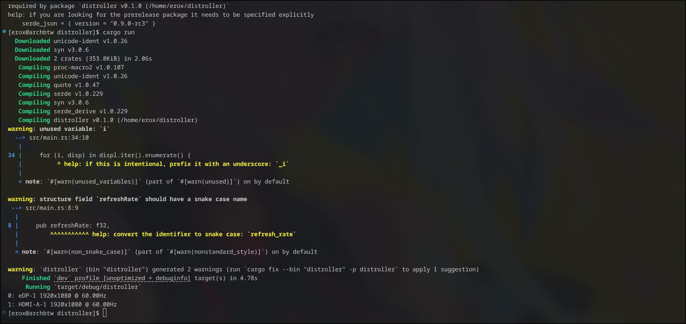

---

Name: "Erox"
Project Title: "Distroller" 

---


# Oct 6

Today i got a monitor (thx stardance) and connected it to my laptop right away , but my hyprland.lua didnt had anything to assign  to the moniter , so it just went with the default one , a diff workspace and i had to configure  it a lot then finally got it to work but now i think i will make a rust based cli tool to automate those things . Easy right? for users not me lol .

i made a basic poc script idea for now

```sh
distroller list
distroller use 1 (here 1 means the 1st moniter like for laptop , it is eDP-1, while the other moniters will turn off maybe? define the state in distroller.conf )
distroller use 2 (HDMI-A-1)
distroller use 1,2... (it gives each moniter diff workspace)
distroller use 1,2 --share (it makes both share a workspace but more like a single monitor , instead of treating both diff) 
distroller use 1,2 --copy (show the same thing)
```
i made it a codeblock but the comments "()" arent valid so dont copy these things ,

now imma gonna start building the base

ok cargo init'd , gonna make all the things in js one file now and distribute later Yeah ik thts easier but still i like redistribute later one.

so build the initial struct , btw i used u8 for height and width at first but it doesnt store 1920 or 1080 so i used u16 as it is better than u32 atleast i think so , also i used f32 for the refreash rate as hyprland give things like 59.64 sometimes , wait wtf am i explain? its basics nah i dont needa explain, nah, i'wd build .  

ok added another struct to copy the vals to new struct wait wait , why am i such a fool? why did i made a struct to js push a value to next struct? ok gotta tirm tht , wait i again figured a thing , i can js follow the hyprctl output's structure lol ,

```
[erox@archbtw ~]$ hyprctl monitors -j
[{
    "id": 0,
    "name": "eDP-1",
    "description": "BOE 0x094A",
    "make": "BOE",
    "model": "0x094A",
    "serial": "",
    "width": 1920,
    "height": 1080,
    "physicalWidth": 340,
    "physicalHeight": 190,
    "refreshRate": 60.00400,
    "x": 0,
    "y": 0,
    "activeWorkspace": {
        "id": 1,
        "name": "1"
    },
    "specialWorkspace": {
        "id": 0,
        "name": ""
    },
    "reserved": [0, 26, 0, 0],
    "scale": 1.5,
    "transform": 0,
    "focused": false,
    "dpmsStatus": true,
    "vrr": false,
    "solitary": "0",
    "solitaryBlockedBy": ["WINDOWED","CANDIDATE"],
    "activelyTearing": false,
    "tearingBlockedBy": ["NOT_TORN","USER","CANDIDATE","HW_CURSOR"],
    "directScanoutTo": "0",
    "directScanoutBlockedBy": ["USER","CANDIDATE"],
    "disabled": false,
    "currentFormat": "XRGB8888",
    "mirrorOf": "none",
    "availableModes": ["1920x1080@60.00Hz","1920x1080@40.00Hz"],
    "colorManagementPreset": "srgb",
    "sdrBrightness": 1,
    "sdrSaturation": 1,
    "sdrMinLuminance": 0.2,
    "sdrMaxLuminance": 80,
    "hardwareCursorsInUse": true
},{
    "id": 1,
    "name": "HDMI-A-1",
    "description": "XXX HDMI",
    "make": "XXX",
    "model": "HDMI",
    "serial": "",
    "width": 1920,
    "height": 1080,
    "physicalWidth": 10,
    "physicalHeight": 10,
    "refreshRate": 60.00000,
    "x": 1280,
    "y": 0,
    "activeWorkspace": {
        "id": 4,
        "name": "4"
    },
    "specialWorkspace": {
        "id": 0,
        "name": ""
    },
    "reserved": [0, 28, 0, 0],
    "scale": 2,
    "transform": 0,
    "focused": true,
    "dpmsStatus": true,
    "vrr": false,
    "solitary": "0",
    "solitaryBlockedBy": ["WINDOWED","CANDIDATE"],
    "activelyTearing": false,
    "tearingBlockedBy": ["NOT_TORN","USER","CANDIDATE","HW_CURSOR"],
    "directScanoutTo": "0",
    "directScanoutBlockedBy": ["USER","CANDIDATE"],
    "disabled": false,
    "currentFormat": "XRGB8888",
    "mirrorOf": "none",
    "availableModes": ["1920x1080@60.00Hz","1920x1080@100.00Hz","1920x1080@74.97Hz","1920x1080@60.00Hz","1920x1080@60.00Hz","1920x1080@59.94Hz","1920x1080@59.94Hz","1920x1080@50.00Hz","1680x1050@59.88Hz","1600x900@60.00Hz","1280x1024@75.03Hz","1280x1024@60.02Hz","1440x900@59.90Hz","1280x960@60.00Hz","1280x800@59.91Hz","1152x864@59.97Hz","1280x720@60.00Hz","1280x720@59.94Hz","1280x720@50.00Hz","1280x720@50.00Hz","1024x768@75.03Hz","1024x768@70.07Hz","1024x768@60.00Hz","800x600@75.00Hz","800x600@72.19Hz","800x600@60.32Hz","800x600@56.25Hz","720x576@50.00Hz","720x576@50.00Hz","720x480@60.00Hz","720x480@60.00Hz","720x480@59.94Hz","720x480@59.94Hz","640x480@75.00Hz","640x480@72.81Hz","640x480@66.67Hz","640x480@60.00Hz","640x480@59.94Hz","640x480@59.94Hz","720x400@70.08Hz"],
    "colorManagementPreset": "srgb",
    "sdrBrightness": 1,
    "sdrSaturation": 1,
    "sdrMinLuminance": 0.2,
    "sdrMaxLuminance": 80,
    "hardwareCursorsInUse": true
}]
[erox@archbtw ~]$ 
```

made the best struct

pub struct Disp {
    pub name: String,
    pub refreshRate: f32,
    pub w: u16,
    pub h: u16,
    pub focused: bool,
    pub disabled: bool,
}

now just gonna fetch frm the hyprctl output and print done 

ok added the code to run hyprlctl monitors -j and fetch the info , but then i got err js because i forgot to add the deserializer and then after i fixed lol cargo toml didnt have derde lol , and now i imported it as macro another lol , and now i forgot to import the feature deserialize with serde . 
bruh this time i js got a err of version mismatch tht was added by cargo  , how life can be worser?

```err
[erox@archbtw distroller]$ cargo run
    Updating crates.io index
error: failed to select a version for the requirement `serde_json = "^1.0.229"`
candidate versions found which didn't match: 1.0.151, 1.0.150, 1.0.149, ...
location searched: crates.io index
required by package `distroller v0.1.0 (/home/erox/distroller)`
help: if you are looking for the prerelease package it needs to be specified explicitly
    serde_json = { version = "0.9.0-rc3" }
[erox@archbtw distroller]$ 
```
ohhh it worked finally :



but wait the 2nd moniter was supposed to be 100hz default , ik its downsampled because of the other moniter , anyways i 'll fix tht later hmhm now imma gonna make the other features .

okk broke main.rs and made ls.rs and main.rs , currently i kept the hypr func (the one to execute hyprctl with structed args as u want ) in ls as idh any hypr.rs , but i will soon move tht to somewhere else as ls.rs is for listing only , yeah thts why i named it ls , i didnt steal the name of ls bash command , wait i kinda did to be honest .

anyways i kept the old main.rs as ~main* for now i will del tht on next commit .

ok after a lot of research , i found `hyprctl eval 'hl.monitor({ output = "eDP-1", disabled = true })'` works to turn of the display so i can make a function inside my new io.rs and use it to turn off on on the display hmhm.


# Oct 8

ok today imma gonna work on the turn off and on function 

done it works , i js used hyprctl command to do it , it wasnt much hard 

after finding some repos i found this `hyprctl eval 'hl.monitor({ output = "eDP-1", disabled = true })'` it ran well so i made a file named 
io.rs and implanted on main done and now  it works though its not usable on terminal , cargo run does the work fine .